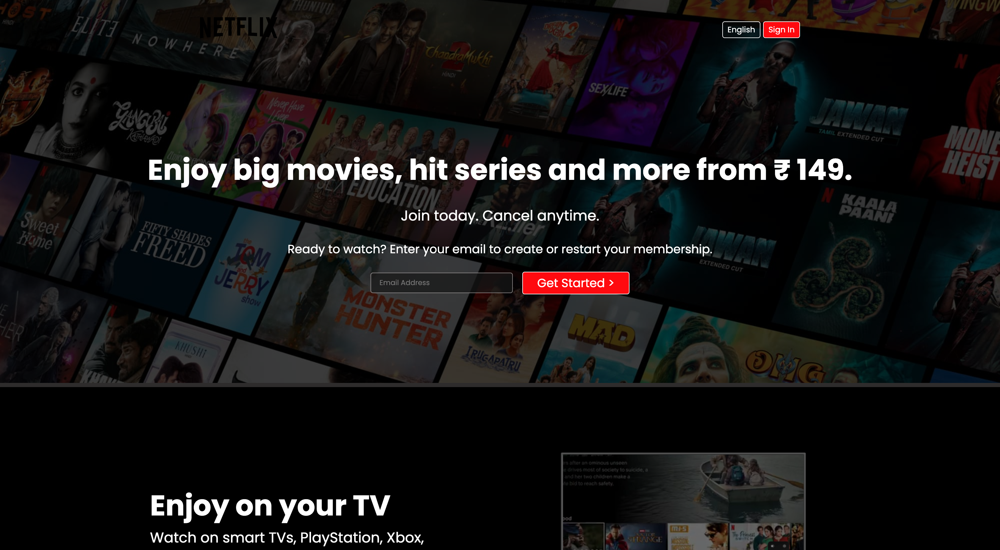
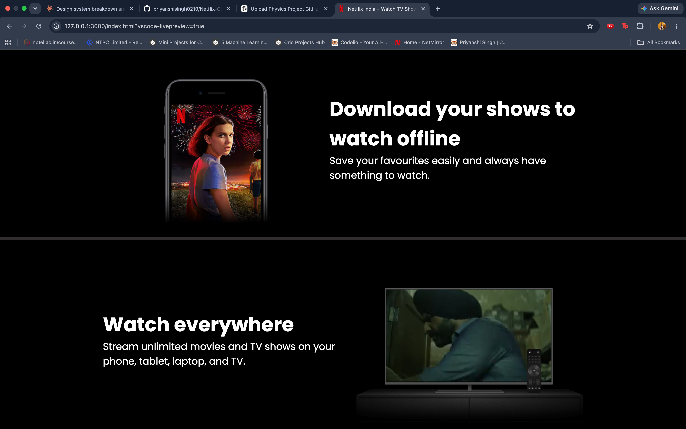

# 🎬 Netflix Clone

A responsive **Netflix landing page clone** built using **HTML and CSS**. This project recreates the look and feel of Netflix's homepage with a clean, modern, and responsive user interface.

---

## 🌟 Features

- 🎥 Netflix-inspired landing page
- 📱 Fully responsive layout
- 🎨 Modern and clean UI
- 🖥️ Desktop-friendly design
- ⚡ Lightweight and fast

---

## 🛠️ Tech Stack

- HTML5
- CSS3

---

## 📸 Screenshots

### 🏠 Home Page



### 🎬 Preview



---

## 📂 Project Structure

```text
Netflix-Clone/
│── assets/
│   └── screenshots/
│       ├── home.png
│       └── preview.png
│── index.html
│── style.css
│── README.md
```

---

## 🚀 Getting Started

1. Clone this repository:

```bash
git clone https://github.com/priyanshisingh0210/Netflix-Clone.git
```

2. Open the project folder.

3. Open `index.html` in your browser.

---

## 🎯 Project Objective

This project was developed to strengthen frontend development skills by recreating Netflix's landing page using only HTML and CSS while focusing on responsive design and layout techniques.

---

## 💡 Future Improvements

- Add JavaScript interactions
- Improve animations
- Add dark/light theme toggle
- Create additional Netflix pages
- Integrate with a movie API

---

## 👩‍💻 Author

**Priyanshi Singh**

- GitHub: https://github.com/priyanshisingh0210
- LinkedIn: https://www.linkedin.com/in/priyanshi-singh-8b4158313

---

## ⭐ Show Your Support

If you found this project useful, consider giving it a ⭐ on GitHub.